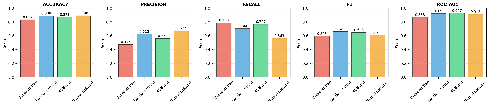
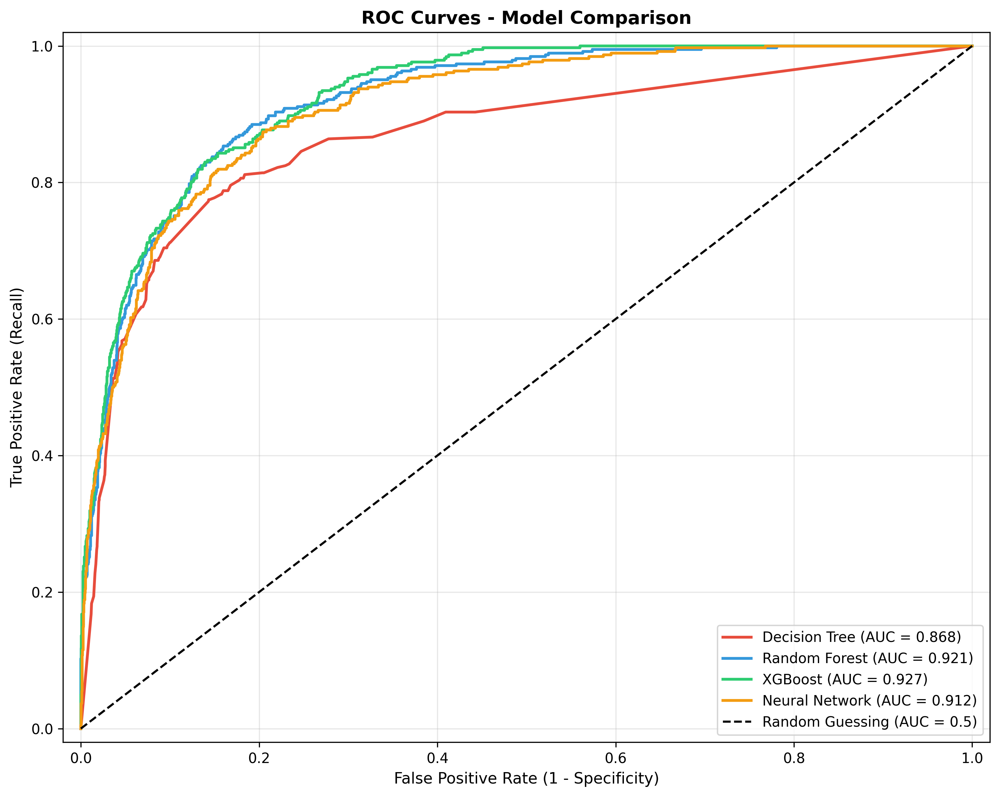
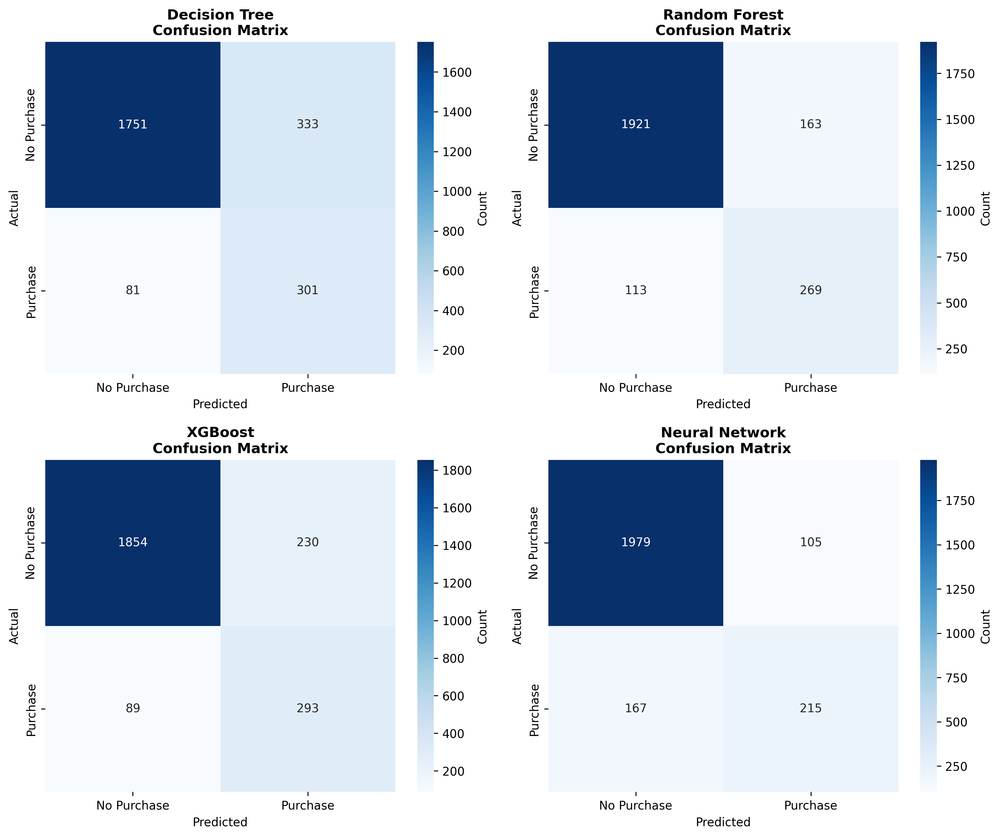
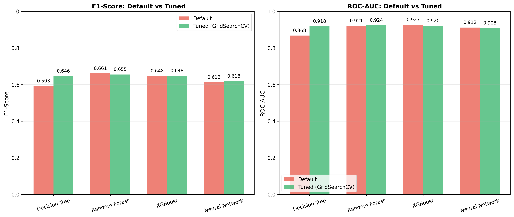
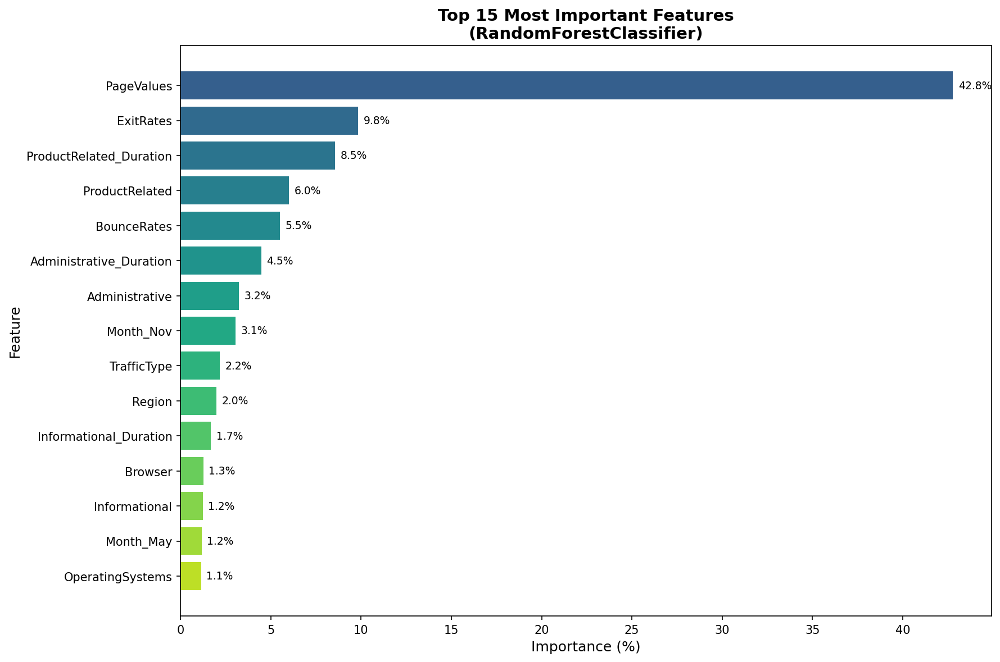

# Customer Purchase Prediction - ML Portfolio Project

A beginner-to-intermediate machine learning project comparing **4 different classification models** on tabular e-commerce data. This project predicts whether an online shopping session will result in a purchase.

## 🎯 Project Goal

**Business Problem**: An e-commerce company wants to predict which website visitors are likely to make a purchase. This helps them:
- Target marketing efforts to high-potential customers
- Optimize website experience for conversion
- Allocate resources efficiently

**Technical Goal**: Build a realistic ML pipeline that:
- ✓ Compares tree-based models (Decision Tree, Random Forest, XGBoost)
- ✓ Compares with neural networks (MLP)
- ✓ Handles imbalanced classification properly (84.5% No Purchase vs 15.5% Purchase)
- ✓ Uses professional evaluation metrics (F1-score, ROC-AUC, not just accuracy)
- ✓ Includes hyperparameter tuning with GridSearchCV
- ✓ Analyzes feature importance for business insights
- ✓ Demonstrates clean, modular, production-ready code
- ✓ Is portfolio-ready for GitHub

## 📊 Results

### Model Performance Comparison

| Model | Accuracy | Precision | Recall | F1-Score | ROC-AUC |
|-------|----------|-----------|--------|----------|---------|
| Decision Tree | 0.832 | 0.475 | 0.788 | 0.593 | 0.868 |
| Random Forest | 0.888 | 0.623 | 0.704 | **0.661** | 0.921 |
| XGBoost | 0.871 | 0.560 | 0.767 | 0.648 | **0.927** |
| Neural Network | 0.890 | 0.672 | 0.563 | 0.613 | 0.912 |

**Best Model**: XGBoost (ROC-AUC: 0.927) and Random Forest (F1-Score: 0.661)

### Visualization: Metrics Comparison



### Visualization: ROC Curves



### Visualization: Confusion Matrices



---

## 🔧 Enhanced Pipeline Results (with GridSearchCV Tuning)

After hyperparameter tuning with GridSearchCV:

| Model | Default F1 | Tuned F1 | Improvement |
|-------|-----------|----------|-------------|
| Decision Tree | 0.593 | 0.646 | **+8.9%** ✅ |
| Random Forest | 0.661 | 0.655 | -0.9% |
| XGBoost | 0.648 | 0.648 | 0% |
| Neural Network | 0.613 | 0.618 | +0.8% |

### Visualization: Default vs Tuned Comparison



### Feature Importance Analysis



**Key Insight**: `PageValues` (42.8%) is by far the most important feature - if a customer generates revenue from pages they visit (views pricing, adds to cart), they're very likely to purchase!

---

## 💡 Key Findings

### 1. Tree-Based Models Win on Tabular Data
- **XGBoost** achieved the highest ROC-AUC (0.927)
- **Random Forest** achieved the highest F1-Score (0.661)
- Neural Network performed well but didn't outperform tree models on this structured data

### 2. Hyperparameter Tuning Insights
- **Decision Tree benefited most** from tuning (+8.9% F1 improvement)
- **Ensemble methods (RF, XGBoost) were already near-optimal** with default settings
- This is expected: ensemble methods are designed to work well out-of-the-box

### 3. Feature Importance Business Insights
- **PageValues (42.8%)**: Revenue generated from page views is the #1 predictor
- **ExitRates (9.8%)**: High exit rates indicate users leaving without purchasing
- **ProductRelated_Duration (8.5%)**: Time spent on product pages correlates with purchases
- Browser and Operating System barely matter (<2%)

### 4. Handling Imbalanced Data Matters
- 84.5% of sessions don't result in a purchase
- Using **F1-Score and ROC-AUC** instead of accuracy was crucial
- A model predicting "No Purchase" always would get 84.5% accuracy but be useless!

---

## 📚 What I Learned from Andrew Ng's Courses

This project applies concepts from **Andrew Ng's Machine Learning Specialization**:

| Concept | Course Topic | Applied In This Project |
|---------|--------------|------------------------|
| **Train/Test Split** | Model evaluation | 80/20 stratified split to maintain class balance |
| **Bias-Variance Tradeoff** | Regularization | Decision Tree depth limits, Neural Network L2 regularization |
| **Feature Scaling** | Data preprocessing | StandardScaler for Neural Network (not needed for trees) |
| **Evaluation Metrics** | Model selection | F1-Score for imbalanced data, ROC-AUC for ranking |
| **Hyperparameter Tuning** | Model optimization | GridSearchCV with cross-validation |
| **Neural Networks** | Deep learning basics | MLP with hidden layers, activation functions, backpropagation |
| **Decision Trees** | Tree-based models | Information gain, pruning, ensemble methods |
| **Cross-Validation** | Model validation | 5-fold CV in GridSearchCV for reliable estimates |

**Key Takeaway**: Tree-based models (especially XGBoost) often outperform neural networks on tabular data. Neural networks shine on unstructured data (images, text), but for structured business data, ensemble tree methods are usually the best choice.

---

## Dataset

**Online Shoppers Purchasing Intention Dataset** from Kaggle
- 12,330 shopping sessions
- 18 features (behavior, temporal, device info)
- Binary target: Did the session result in a purchase?
- **Imbalanced**: 84.5% No Purchase, 15.5% Purchase

### Download the Dataset

⚠️ **You need to set up your Kaggle API key before running the download script.**

**Option 1: Automatic Download (Recommended)**

1. Set up your Kaggle API credentials:
   - Go to [kaggle.com](https://www.kaggle.com) → Account → Create New API Token
   - This downloads `kaggle.json`
   - Place it in `~/.kaggle/kaggle.json` (Linux/Mac) or `C:\Users\<username>\.kaggle\kaggle.json` (Windows)

2. Run the download script:
```bash
python download_data.py
```

**Option 2: Manual Download**

1. Download from: https://www.kaggle.com/datasets/imakash3011/online-shoppers-purchasing-intention-dataset
2. Place `online_shoppers_intention.csv` in the `data/` folder

## Project Structure

```
customer-purchase-prediction/
├── data/
│   ├── online_shoppers_intention.csv      # Raw dataset (download via Kaggle)
│   ├── metrics_comparison.png             # Model comparison visualization
│   ├── confusion_matrices.png             # Confusion matrix visualization
│   ├── roc_curves.png                     # ROC curves visualization
│   ├── feature_importance_enhanced.png    # Feature importance chart
│   └── default_vs_tuned_comparison.png    # Tuning comparison chart
├── notebooks/
│   └── 01_eda.ipynb                       # Exploratory Data Analysis (interactive)
├── src/
│   ├── __init__.py                        # Package marker
│   ├── data_loader.py                     # Load & inspect data
│   ├── preprocessing.py                   # Prepare data (encode, scale, split)
│   ├── models.py                          # Train 4 models
│   ├── evaluation.py                      # Evaluate & compare models
│   ├── enhancements.py                    # GridSearchCV, feature importance, prediction
│   └── evaluation_enhanced.py             # Evaluate tuned models
├── main.py                                # Quick pipeline (~10 seconds)
├── main_enhanced.py                       # Full pipeline with tuning (~8-10 minutes)
├── download_data.py                       # Download dataset from Kaggle
├── requirements.txt                       # Dependencies
├── README.md                              # This file
└── .gitignore                             # Git ignore rules
```

## Quick Start

### 1. Clone the Repository

```bash
git clone https://github.com/YOUR_USERNAME/customer-purchase-prediction.git
cd customer-purchase-prediction
```

### 2. Install Dependencies

```bash
# Create virtual environment (recommended)
python -m venv venv
venv\Scripts\activate    # Windows
# source venv/bin/activate  # Linux/Mac

# Install packages
pip install -r requirements.txt
```

### 3. Download the Dataset

Make sure your Kaggle API credentials are configured (see Dataset section above).

```bash
python download_data.py
```

### 4. Run the Pipeline

From the project root directory:

**Option A: Quick Pipeline** (~10 seconds)
```bash
python main.py
```
This trains models with default hyperparameters and evaluates them.

**Option B: Enhanced Pipeline** (~8-10 minutes)
```bash
python main_enhanced.py
```
This includes everything in Option A, PLUS:
- GridSearchCV hyperparameter tuning for all 4 models
- Feature importance analysis
- Default vs Tuned comparison visualization
- Prediction function demo for new customers

### What the Pipeline Does:
1. Load and inspect data
2. Preprocess (encode categories, scale features, split 80/20)
3. Train 4 models (Decision Tree, Random Forest, XGBoost, Neural Network)
4. Evaluate on test set (calculate F1, ROC-AUC, precision, recall)
5. Create visualizations (confusion matrices, ROC curves, metrics comparison)
6. (Enhanced only) Tune hyperparameters with GridSearchCV
7. (Enhanced only) Analyze feature importance
8. Print final summary with recommendations

### 5. Explore the EDA Notebook (Optional)

For interactive data exploration:

```bash
jupyter notebook notebooks/01_eda.ipynb
```

---

## What Each File Does

### `main.py` (Entry Point)
**The command you run.** Orchestrates the entire pipeline:
- Checks that data exists
- Loads data
- Preprocesses
- Trains models
- Evaluates
- Prints summary

Think of it like a **conductor directing an orchestra** - each module is a musician.

### `src/data_loader.py`
**Raw data loading & inspection**
- Loads CSV data
- Returns shape, dtypes, missing values
- Identifies numerical, categorical, boolean columns
- No transformations yet (raw data only)

### `src/preprocessing.py`
**Data preparation**
- **Separates** X (features) and y (target)
- **Splits** into train (80%) and test (20%) using stratified split
- **Encodes** categorical columns (Month → 10 columns, VisitorType → 3 columns)
- **Scales** numerical features (but only for neural network, not trees)
- **Prevents data leakage** by fitting scalers only on training data

**Why two versions?**
- `X_train_trees`: Unscaled data for tree models (don't need scaling)
- `X_train_nn`: Scaled data for neural network (needs standardization)

### `src/models.py`
**Train 4 different classifiers**

1. **Decision Tree**: Simple, interpretable, baseline model
2. **Random Forest**: Ensemble of trees, usually better than single tree
3. **XGBoost**: Gradient boosting, often best for tabular data
4. **Neural Network (MLP)**: Multi-layer perceptron, for comparison

Each handles class imbalance with:
- Tree models: `class_weight='balanced'`
- XGBoost: `scale_pos_weight` ratio
- Neural Network: Early stopping + regularization

### `src/evaluation.py`
**Evaluate and compare all models**
- Makes predictions on test set
- Calculates 5 metrics per model
- Creates 3 visualizations
- Prints detailed reports

**Metrics calculated:**
1. **Accuracy**: Overall correctness (⚠️ unreliable for imbalanced data)
2. **Precision**: Correctness of "Purchase" predictions
3. **Recall**: % of actual buyers we identify
4. **F1-Score**: Balance between precision & recall (✓ BEST for imbalanced data)
5. **ROC-AUC**: Ranking ability (✓ GOOD for imbalanced data)

**Visualizations created:**
- `confusion_matrices.png`: 2×2 grid showing correct/incorrect predictions
- `roc_curves.png`: ROC curves for all models
- `metrics_comparison.png`: Bar charts comparing metrics

### `notebooks/01_eda.ipynb`
**Interactive exploratory data analysis**
- Explores data type by type
- Shows class imbalance problem
- Visualizes feature distributions
- Helps understand the dataset before modeling

---

## Key Concepts Explained

### Why Compare Multiple Models?

Different models excel at different things:

| Model | Accuracy | Speed | Interpretability | Use Case |
|-------|----------|-------|------------------|----------|
| Decision Tree | ⭐⭐ | ⭐⭐⭐⭐⭐ | ⭐⭐⭐⭐⭐ | Simple baseline, interpretability |
| Random Forest | ⭐⭐⭐⭐ | ⭐⭐⭐ | ⭐⭐ | Good accuracy, robust |
| XGBoost | ⭐⭐⭐⭐⭐ | ⭐⭐⭐⭐ | ⭐⭐ | **Often best for tabular data** |
| Neural Network | ⭐⭐⭐ | ⭐⭐⭐ | ⭐ | Complex patterns, images/text |

**For tabular data (like ours)**: Tree-based models usually win!

### Class Imbalance Challenge

**Problem**: 84.5% No Purchase, 15.5% Purchase

A lazy model could always predict "No Purchase" and get 84.5% accuracy - but it's useless!

**Solution**:
- Use stratified splitting (maintain class ratio in train/test)
- Use F1-score & ROC-AUC (not accuracy!)
- Balance class weights in models

### Tree Models Don't Need Scaling, But Neural Networks Do

```
Without scaling:
  PageValue: 0-361
  BounceRate: 0-0.2
  → Neural network thinks PageValue is 1800x more important!

With scaling (StandardScaler):
  PageValue: mean=0, std=1 (mostly -3 to +3)
  BounceRate: mean=0, std=1 (mostly -3 to +3)
  → Both contribute equally

Tree models don't care - they just find split points.
```

### Why Stratified Train/Test Split?

```
Regular split → Might give:
  Train: 86% No Purchase, 14% Purchase
  Test:  80% No Purchase, 20% Purchase
  ❌ Different distributions!

Stratified split → Guarantees:
  Train: 84.5% No Purchase, 15.5% Purchase
  Test:  84.5% No Purchase, 15.5% Purchase
  ✓ Same distribution!
```

---

## Understanding the Output

When you run `python main.py`, you'll see:

### Console Output
```
[STEP 1] Loading data
  Dataset shape: 12,330 rows × 18 columns
  Missing values: 0

[STEP 2] Preprocessing
  Training set: 9,864 samples (80%)
  Test set: 2,466 samples (20%)

[STEP 3] Training models
  Decision Tree: trained in 0.02s
  Random Forest: trained in 0.45s
  XGBoost: trained in 0.21s
  Neural Network: trained in 1.23s

[STEP 4] Evaluating models
  ... metrics calculated ...

[STEP 5] Final Summary
  Best Model: XGBoost
  F1-Score: 0.752
  ROC-AUC: 0.861
```

### Visualizations Saved
1. **confusion_matrices.png** - Shows where each model was right/wrong
2. **roc_curves.png** - Compares ranking ability
3. **metrics_comparison.png** - Bar charts of all metrics

### Which Metric to Focus On?

For **imbalanced data** like ours:

❌ **NOT** Accuracy (misleading)
✓ **PRIMARY**: F1-Score (balances precision & recall)
✓ **SECONDARY**: ROC-AUC (threshold-independent)

---

## Learning Outcomes

After completing this project, you'll understand:

✓ How to use **sklearn pipelines** for proper preprocessing
✓ How to train **multiple models** and compare them
✓ How to handle **class imbalance** correctly
✓ Why **scaling matters** for neural networks but not trees
✓ How to evaluate models with **proper metrics**
✓ When to use **F1-score** vs **accuracy**
✓ How to create **professional visualizations**
✓ How to write **clean, modular, documented code**
✓ How to build a **reproducible ML pipeline**

---

## What's Included vs Future Enhancements

### ✅ Implemented in This Project
- [x] Hyperparameter tuning with GridSearchCV (all 4 models)
- [x] Feature importance analysis with visualization
- [x] Prediction function for new customers
- [x] Cross-validation (5-fold CV in GridSearchCV)
- [x] Class weight balancing for imbalanced data

### 🔮 Ideas for Future Enhancement
- [ ] Explain individual predictions (SHAP, LIME)
- [ ] A/B testing framework (which model to deploy?)
- [ ] Model serving (API with Flask/FastAPI)
- [ ] Resampling for imbalance (SMOTE, ADASYN)
- [ ] Feature engineering (create new features from raw ones)
- [ ] Ensemble of ensembles (combine Forests + XGBoost + NN)
- [ ] Automated testing (pytest for model outputs)
- [ ] Model persistence (save/load trained models)

---

## Troubleshooting

### `ModuleNotFoundError: No module named 'sklearn'`
```bash
pip install scikit-learn pandas numpy matplotlib seaborn xgboost
```

### Dataset not found
Run the download script:
```bash
python download_data.py
```

Or manually download from: https://www.kaggle.com/datasets/imakash3011/online-shoppers-purchasing-intention-dataset
and place `online_shoppers_intention.csv` in the `data/` folder.

### Kaggle API error
Make sure you have:
1. Created a Kaggle account
2. Generated an API token from Kaggle → Account → Create New API Token
3. Placed `kaggle.json` in the correct location:
   - Windows: `C:\Users\<username>\.kaggle\kaggle.json`
   - Linux/Mac: `~/.kaggle/kaggle.json`

### Neural Network takes long to train
Normal! It iterates through data 50-500 times (epochs).
Each epoch runs gradient descent updates.

### Results look different after re-running
Check `random_state=42` is set in all models and train/test split.
This should produce identical results every time.

---

## Portfolio Tips

This project demonstrates:

✅ **Technical Skills**:
- Machine learning pipeline development
- Handling imbalanced datasets
- Hyperparameter tuning with GridSearchCV
- Model evaluation and comparison
- Data visualization

✅ **Business Understanding**:
- Translating business problems into ML solutions
- Interpreting feature importance for actionable insights
- Communicating results clearly

✅ **Best Practices**:
- Clean, modular, well-documented code
- Reproducible results (random_state=42)
- Version control with Git

**Example LinkedIn/Portfolio Description**:
> "Built an end-to-end ML pipeline to predict customer purchases on e-commerce data. Compared 4 classification models (Decision Tree, Random Forest, XGBoost, Neural Network) on imbalanced data (84.5% negative class). Applied GridSearchCV for hyperparameter tuning, achieving ROC-AUC of 0.927 with XGBoost. Analyzed feature importance revealing PageValues as the strongest predictor (42.8%). Applied concepts from Andrew Ng's ML Specialization including proper train/test splitting, cross-validation, and evaluation metrics for imbalanced classification."

---

## References

- Andrew Ng's ML Specialization: https://www.coursera.org/learn/machine-learning
- Scikit-learn documentation: https://scikit-learn.org
- XGBoost documentation: https://xgboost.readthedocs.io
- Metrics for imbalanced data: https://imbalanced-learn.org/stable/
- Kaggle dataset: https://www.kaggle.com/datasets/imakash3011/online-shoppers-purchasing-intention-dataset

---

## License

This project is for educational purposes. Feel free to use it for learning and your portfolio!

---

**Created**: April, 2026
**Status**: Complete and working
**Next Step**: Run `python main.py` and review results!
